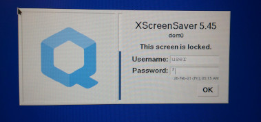

This is XScreenSaver replacing the Fire logo with Qubes logo, and rebranding for Qubes.
The reasoning behind this is in [this issue](https://github.com/QubesOS/qubes-issues/issues/6425)

A working prototype is shown:

